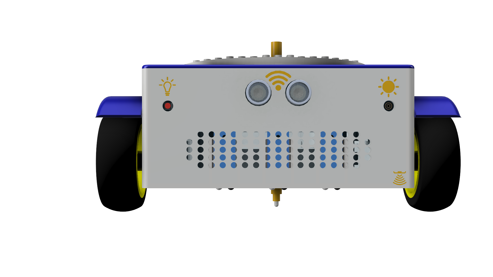
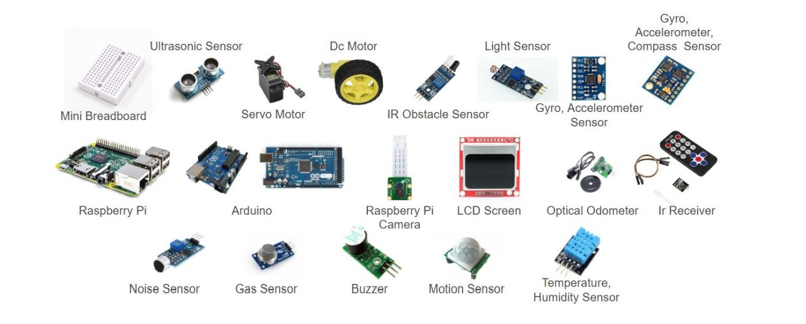

FOSSBot belongs to the DIY (Do It Yourself) category, with the logic that it can easily be built by other people besides its creators, and its disassembly and reassembly process can be part of an educational process in the classroom. This is possible since  FOSSBot is made of electronic materials that can be easily found commercially at low cost while the plastic parts are printable.

## Equipment 
#### Sensors:
* Ultrasonic distance sensor
* Battery Sensor
* Accelerometer
* Gyroscope
* Odometers
* IR Receiver
* Line detection sensors
* Light Sensors

#### General Features:
* Lego compatible surface
* Hole in front for marker/ pencil attachment
* Special pulling loop
* Rechargeable batteries

#### Interaction Features:
* Speaker
* Front RGB LED

## 3D printed parts

All the plastic parts, except from the wheels, are printable on a 3D printer and the total printing time does not exceed 36 hours. It is worth mentioning that the body of the robot has been designed in such a way as to facilitate its assembly process. This has been achieved since cases have been designed inside the robot, adapted to the electronic components, so that they are placed in the corresponding positions and do not move during the use of the robot. Also, on the outer surface there are printed symbols that indicate the position of each sensor. The symbols also help teachers to know the position of the sensors, e.g. speaker, led, etc. The vertical tube that runs from top to bottom of the main body of the robot allows for the attachment of a pencil or marker, so that by moving the FOSSBot around an area covered with paper, shapes can be created.

Printed meshes on the front and top of the robot help keep electrical parts cool. The robot's charging port, on/off switch, and a unique loop for towing small items are all located on the back. The loop also serves to protect the robot from minor collisions. Two printed spoilers above the wheels add to wheel protection and to the robot's aesthetic design.

The top surface of the robot is divided into two pieces. A cover that attaches to the main body using unique clips is the original accessory. The main cover can be joined to the top cover using an easy twist-and-lock function. It can be easily removed to give access to the interior of the robot and can also support a base of Lego bricks, allowing bricks to be added on top of the robot. This option enables lower grade teachers to combine FOSSBot with other Lego projects and can help add new activities to FOSSBot.

## Printing and assembly instructions

Printing and assembly instructions and figures can be found in this manual.

## Hardware/Software Development Team
* Iraklis Varlamis - Mentor
* Christos Chronis
* Eleftheria Papageorgiou

