The newer version of the FOSSBot is available here, where you can find the 3D models and instructions to build it.

The redesign of the robot is complete, and the files are available for download.

The circuit schematics, instructions, and firmware code will be available soon.

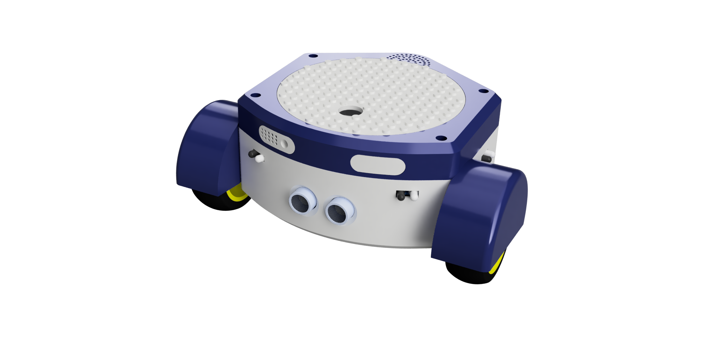

## 3D Printable Part List
---
* [Battery Cover](stl/batterycover.stl)
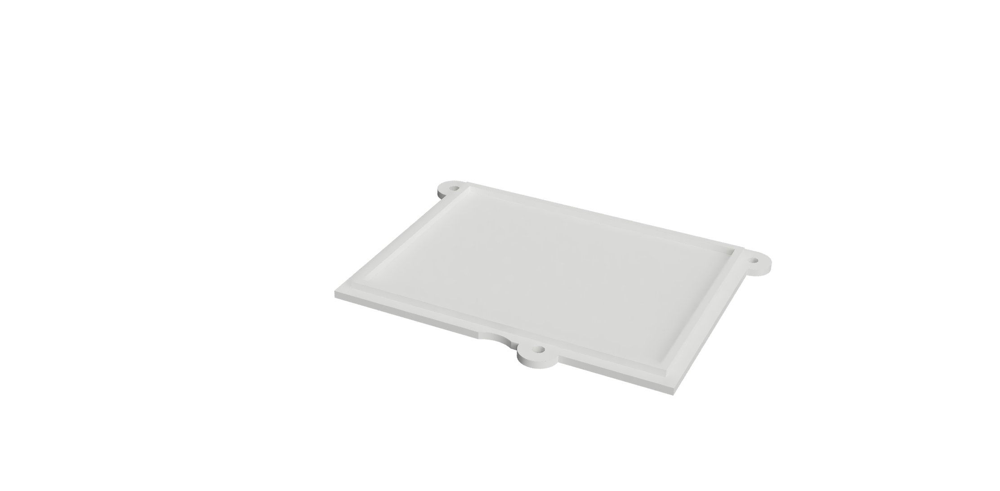
---
* [Bottom Base](stl/b1_p_f.stl)
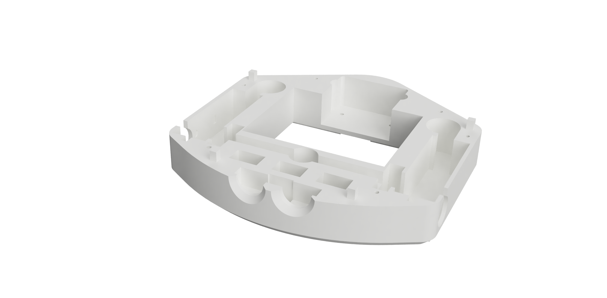
---
* [Middle Base](stl/b2_p_f.stl)
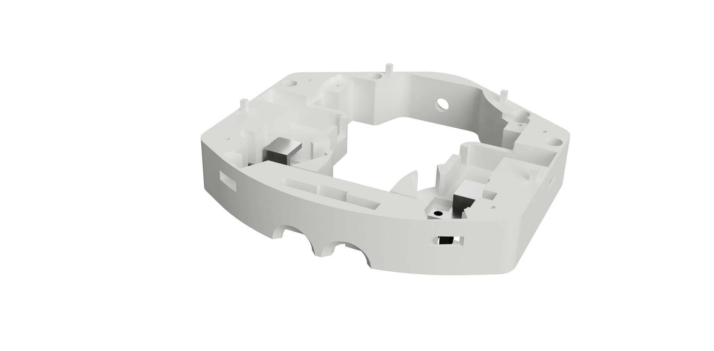
---
* [Top Base](stl/b3_p_f.stl)
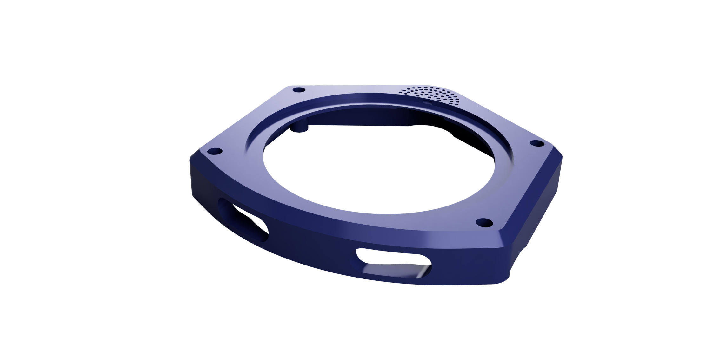
---
* [Left eye](stl/left_eye.stl)
* [Right eye](stl/right_eye.stl)
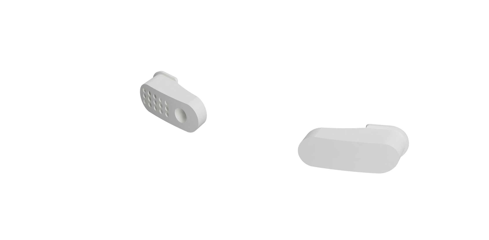
---
* [Top Cover](stl/lego_top.stl)
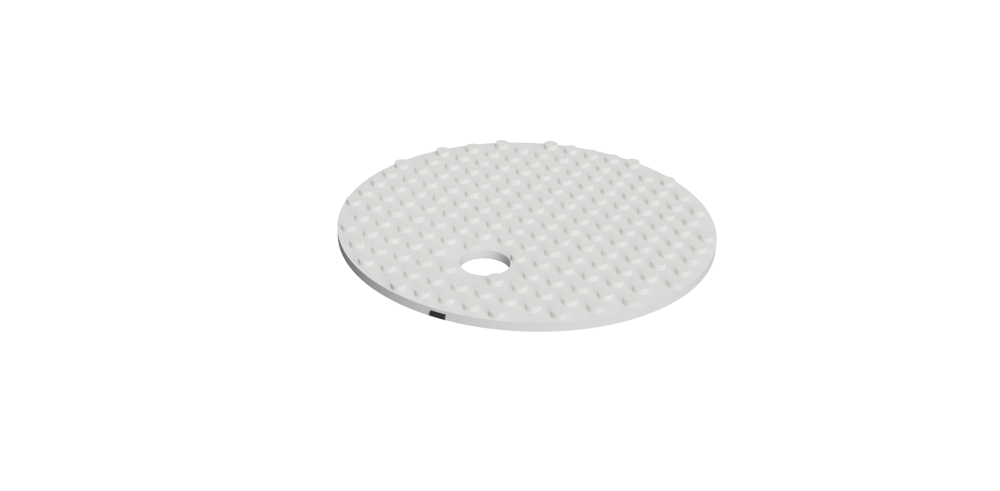
---
* [Pen Holder](stl/pen_holder.stl)
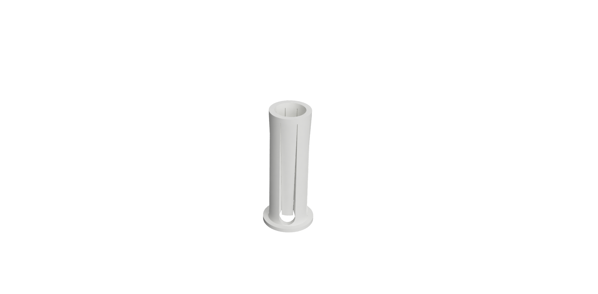
---
* [Spoiler Left](stl/fender_left.stl)
* [Spoiler Right](stl/fender_right.stl)
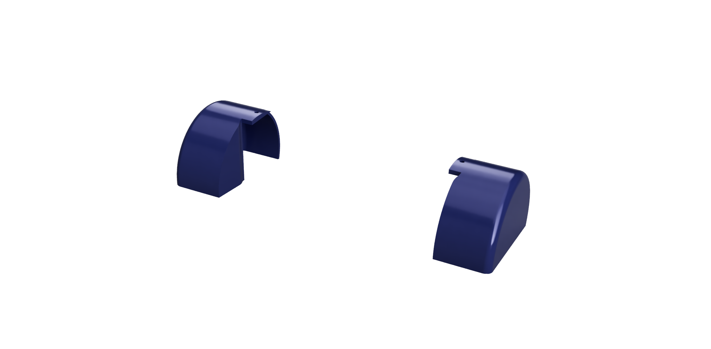
---

## PCB
---
* [Main PCB production file](PCB/production/fossbot-v2-main-pcb.zip)
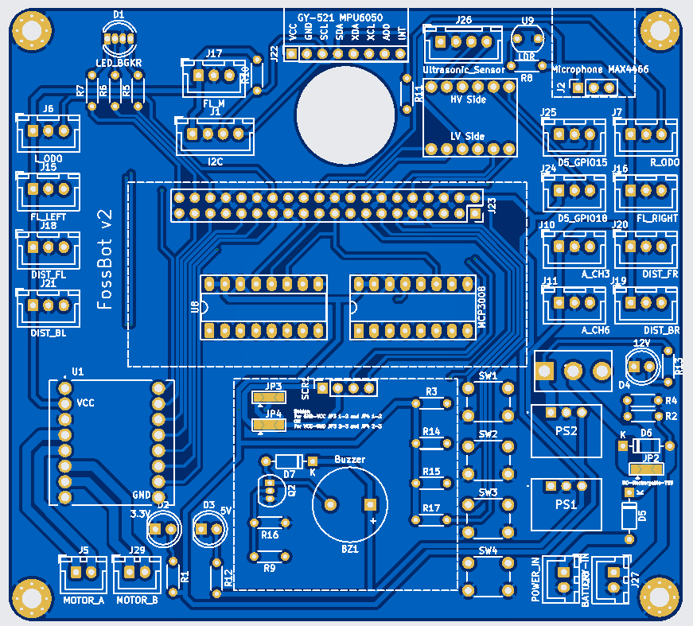
---
* [Battery module production file](PCB/production/battery_module.zip)
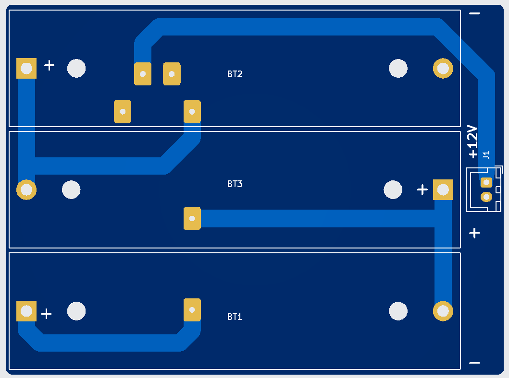
---

## Hardware/Software Development Team
* Christos Chronis
* Dimitris Charitos
* Adrien BRACQ - Barbatronic

