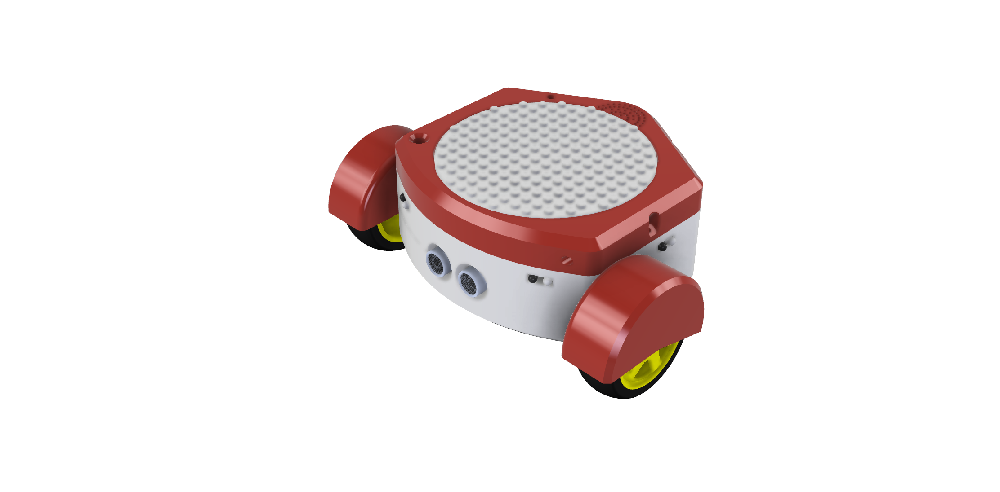
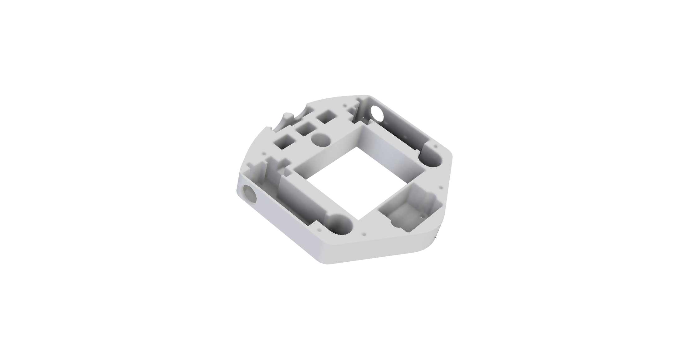
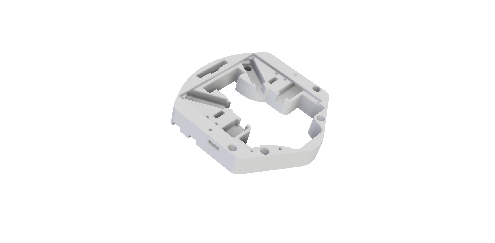
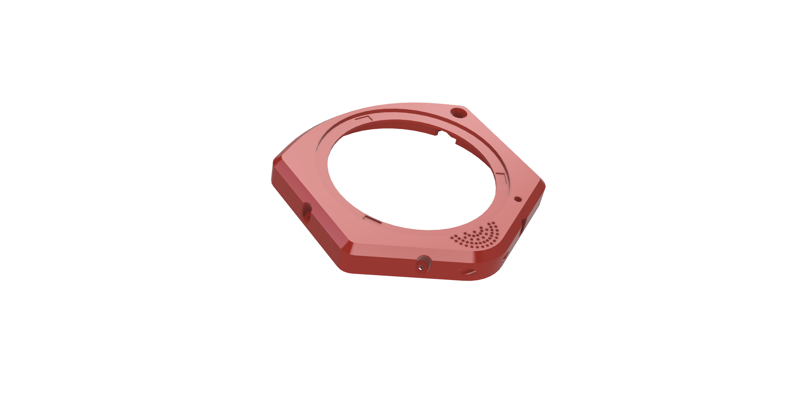
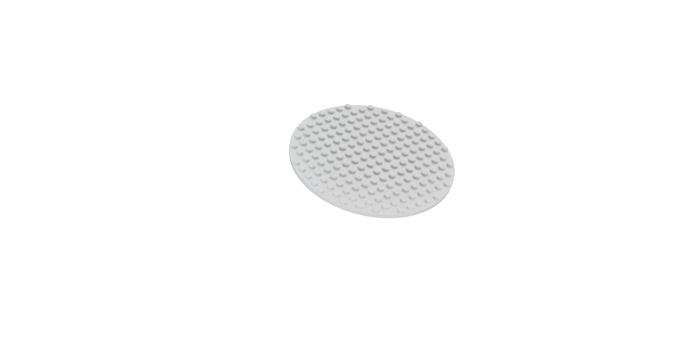
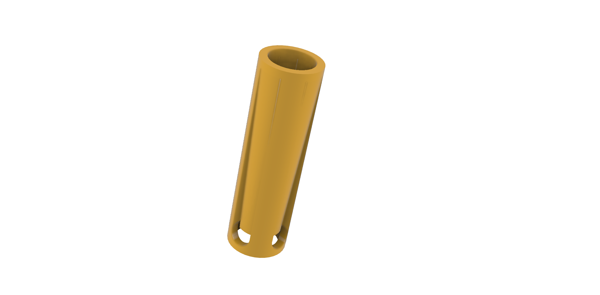
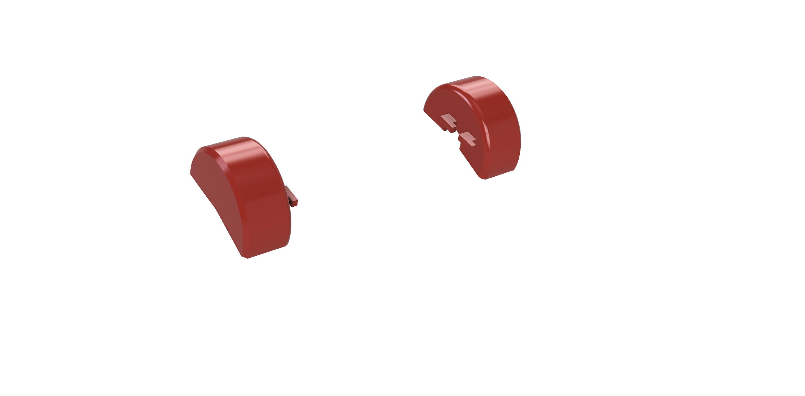

The newer version of the FOSSBot is available here, where you can find the 3D models and instructions to build it.

This version of the robot is currently under development, so the instructions are not yet complete, and the final version of the 3D-printed parts may differ.

## 3D Printable Part List
---
* [Battery Cover](stl/battery_cover.stl)

---
* [Bottom Base](stl/bbase.stl)

---
* [Middle Base](stl/mbase.stl)

---
* [Top Base](stl/tbase.stl)

---
* [Top Cover](stl/tcover.stl)

---
* [Pen Holder](stl/pen_holder.stl)

---
* [Spoiler Left](stl/spoiler_l.stl)
* [Spoiler Right](stl/spoiler_r.stl)

---

## Hardware/Software Development Team
* Christos Chronis
* Dimitris Charitos

